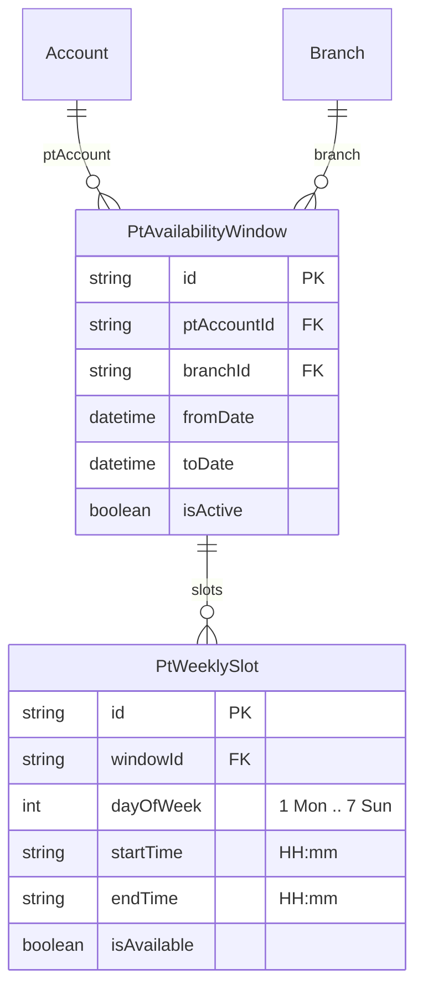

# PT: chi nhánh + range ngày + thời khoá biểu tuần (cho UI grid)

## Bối cảnh hiện tại

- [`prisma/schema.prisma`](/Users/ad/Documents/Petproject/bestGym/backend/prisma/schema.prisma): **`PtShiftTemplate`** (ShiftType cố định) + **`PtShiftSchedule`** (branch, `shiftTemplateId`, `fromDate`/`toDate`, **`maxStudents`**).
- [`src/personal-trainer/personal-trainer.service.ts`](/Users/ad/Documents/Petproject/bestGym/backend/src/personal-trainer/personal-trainer.service.ts): `createPtTrainingSlot` / `getPtTrainingSlots` dùng `shiftTemplateId` + `maxStudents`.
- [`src/user-package/user-package.service.ts`](/Users/ad/Documents/Petproject/bestGym/backend/src/user-package/user-package.service.ts): `getAvailablePTs` filter theo **`shiftType`** và `ptShiftSchedule` + template; **`createRequestPT`** dùng **`slotId` = PtShiftSchedule**, ghép **`sessionDate` + shiftTemplate.start/end**, full slot khi **`usedSeats >= maxStudents`**.
- Seed: [`prisma/seeds/seed-ptShift-Schedule.ts`](/Users/ad/Documents/Petproject/bestGym/backend/prisma/seeds/seed-ptShift-Schedule.ts) chỉ upsert template 3 ca.

## Mục tiêu sản phẩm

1. PT chỉ đăng ký **một chi nhánh** và **range ngày** làm tại chi nhánh đó (không chọn ca MORNING/AFTERNOON/EVENING).
2. **Không có** giới hạn cấu hình `maxStudents` (xoá khỏi model / luồng tạo lịch).
3. **Lưu thời khoá biểu** có cấu trúc đủ để FE vẽ lưới giống hình (cột **Thứ 2 … Chủ nhật**, hàng các khung giờ 2h như **06:00–08:00**, **08:00–10:00**, …).

## Kiến trúc dữ liệu đề xuất

Giữ một **lưới slot cố định trong code** (không nhất thiết bảng `PtShiftTemplate` nữa), khớp hình của bạn, ví dụ:

- Khung giờ: `06–08`, `08–10`, `10–12`, `13–15`, `15–17`, `17–19`, `19–21` (chuỗi `startTime/endTime` dạng `"HH:mm"`).
- **`dayOfWeek`**: ISO-style **1 = Thứ 2 … 7 = Chủ nhật** hoặc theo convention hiện tại codebase (ghi rõ trong DTO và doc API).

Schema mới (tên có thể tinh chỉnh khi code):

- **`PtAvailabilityWindow`**: “PT làm ở branch X từ ngày A đến B”.
- **`PtWeeklySlot`**: một ô trong lịch recurring (đúng cột ngày + đúng hàng giờ). `isAvailable` cho phép bật/tắt từng ô (PT không phải chọn đủ 7×N ô).

Đặt lịch user: **`CreatePtAssistRequestDto`** không cần chỉ tay `weeklySlotId` nếu bạn muốn UI gửi lại **ngày + start/end** đã được chọn trong grid — backend validate trùng với **`PtWeeklySlot`** (kèm **`window`** active, date nằm trong range, và `requestedStart`'s dow khớp). Cách nhẹ nhất là **`weeklySlotId` + `sessionDate`** như hiện tại với `slotId`.

**Độc quyền buổi:** không còn `maxStudents`; với PT dạy kèm, nên giữ **`count >= 1`** cho cùng `(ptAccountId, startTime, endTime)` với status PENDING|ACCEPTED để không double-book một slot (đúng UX “ĐÃ BOOK”). Nếu bạn thật sự muốn nhiều học viên cùng giờ, cần yêu cầu riêng (hiện tại không nêu).

## Thay đổi backend theo layer

### 1. Migration Prisma + xử lý cũ

- Thêm **`PtAvailabilityWindow`** + **`PtWeeklySlot`**.
- Migrate dữ liệu **`PtShiftSchedule`** cũ: mỗi bản ghi → tạo **một Window** `(pt, branch, from, to)` + **bảy dòng WeeklySlot** (Thứ 2–CN) hoặc “mỗi ngày” với **`start/end` từ template cũ** và **`isAvailable: true`** (tương đương hành vi cũ: mọi ngày trong range cùng khung giờ).
- Xóa / deprecate **`PtShiftSchedule`** và **`PtShiftTemplate`**, và enum **`ShiftType`** nếu không còn tham chiếu.
- Cleanup index: `weeklySlot.windowId`, có thể `@@unique([windowId, dayOfWeek, startTime, endTime])` để tránh trùng ô.

### 2. Constants lưới + timezone

- Thêm module ví dụ [`src/pt-schedule/grid-slots.constants.ts`] (đường dẫn gợi ý): mảng `GRID_SLOT_DEFS`.
- Chuẩn hoá **`sessionDate`/“đã qua”** và so sánh **`requestedStart/end`**: trong plan ghi chú là nên ép **Asia/Ho_Chi_Minh** (đồng bộ với `getCheckinsGrouped`) thay vì chỉ `"${date}T...Z"` nếu UI hiển thị giờ VN — đây là chỉnh có thể gây breaking; nên có bước review rõ với FE.

### 3. PT API ([`personal-trainer.service.ts`](/Users/ad/Documents/Petproject/bestGym/backend/src/personal-trainer/personal-trainer.service.ts))

- Thay **`CreatePtTrainingSlotDto`**: bỏ `shiftTemplateId`, `maxStudents`; thêm `fromDate`, `toDate`, `branchId`, và ví dụ `slots: Array<{ dayOfWeek, startTime, endTime, isAvailable }>` chỉ chứa ô **được bật** (hoặc gửi full grid — ưu tiên payload chỉ các ô ON).
- Thay **`createPtTrainingSlot`**: tạo **Window + batch WeeklySlot**, validate không overlap hai window `(pt + branch)` trên cùng khoảng ngày chồng nhau hoặc policy bạn chọn (tối thiểu: không duplicate slot key trong một window).
- Thay **`getPtTrainingSlots`**: trả về danh sách window + các weekly slot đã lưu.
- **`getShiftTemplates` / `GET pt/shift-templates`**: **xóa hoặc thay** bằng ví dụ `GET pt/booking-slot-grid-definition` chỉ trả **danh sách slot cố định** trong code cho FE (`GRID_SLOT_DEFS`).

### 4. User / listing PT ([`user-package.service.ts`](/Users/ad/Documents/Petproject/bestGym/backend/src/user-package/user-package.service.ts))

- **`FilterAvailablePtDto`** ([`filter-available-pt.dto.ts`](/Users/ad/Documents/Petproject/bestGym/backend/src/user-package/dto/filter-available-pt.dto.ts)): **bỏ `shiftType`** (optional khác không đổi).
- **`getAvailablePTs`**: join `PtAvailabilityWindow` + ít nhất một `WeeklySlot` `isAvailable` có overlap với `from`/`to` query.

### 5. **`createRequestPT`**

- Đọc slot theo **`PtWeeklySlot` + Window** (thay **`PtShiftSchedule` + PtShiftTemplate**).
- Tính **`requestedStart`/`requestedEnd`** từ `sessionDate`, `slot.start/end`, TZ đã chốt.
- Validate: date trong **`[window.fromDate, window.toDate]`**, branch khớp user package; **quota PT** và **exclusive** một buổi như đã có (đổi điều kiện `usedSeats` từ `maxStudents` → **>= 1** nếu single-booking).

### 6. Seed

- **`seed-ptShift-Schedule.ts`**: bỏ seed template 3 ca; có thể thêm seed demo **Windows + WeeklySlot** ghép PT + branch trong [`seed-ptShift-Schedule.ts`](/Users/ad/Documents/Petproject/bestGym/backend/prisma/seeds/seed-ptShift-Schedule.ts) hoặc file seed mới, gọi từ [`prisma/seed.ts`](/Users/ad/Documents/Petproject/bestGym/backend/prisma/seed.ts).

### 7. Endpoint đọc riêng cho UI grid (tùy chọn nhưng nên có)

- Ví dụ **`GET`** (USER hoặc public): params `branchId`, `ptAccountId`, `weekStart` (yyyy-mm-dd):

  Response: các **ngày trong tuần**, mỗi ngày list **ô slot**: `{ gridKey hoặc weeklySlotId, start, end, state: PASSED | FREE | OCCUPIED }` trong đó OCCUPIED = đã có PENDING|ACCEPTED trùng `pt + start/end` (instant).

Đặt vào **`user-package`** controller (user role) để không lộ PT admin data.

---

## Rủi ro / chỉnh với frontend

- Thay **`slotId`**: có thể vẫn là UUID của **`PtWeeklySlot`** + **`sessionDate`** — FE lưới gửi đúng một `weeklySlotId` visible cho ô đã chọn.
- Mọi client cũ gọi **`shift-template`** / **`shiftType`** **sẽ gãy**: cập nhật mobile/web.
