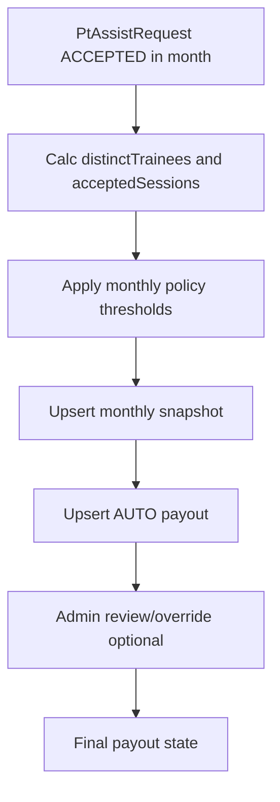

# KPI tháng và thưởng PT

## Nghiệp vụ đã chốt

- KPI tháng tính theo **cả 2 chỉ số**:
  - số trainee duy nhất PT đã dạy trong tháng
  - số buổi PT đã dạy trong tháng
- Chỉ tính dữ liệu ở trạng thái `PtAssistRequest.status = ACCEPTED`.
- Rule thưởng: **single-threshold** (đạt >= KPI thì nhận 1 khoản tiền cố định).
- Luồng thưởng: **tự động chốt cuối tháng + admin có quyền override**.

## Thiết kế dữ liệu (Prisma)

- Cập nhật [`/Users/ad/Documents/Petproject/bestGym/backend/prisma/schema.prisma`](/Users/ad/Documents/Petproject/bestGym/backend/prisma/schema.prisma) với 3 model mới:
  - `PtMonthlyKpiPolicy`: cấu hình KPI theo tháng (monthKey, targetTrainees, targetSessions, rewardAmount, isActive, createdByAdminId).
  - `PtMonthlyKpiSnapshot`: số liệu chốt của từng PT/tháng (distinctTrainees, acceptedSessions, achieved, rewardAmountAuto).
  - `PtMonthlyRewardPayout`: bản ghi chi thưởng (amountFinal, status DRAFT|APPROVED|PAID|VOID, source AUTO|MANUAL_OVERRIDE, approvedByAdminId, note).
- Chỉ mục/unique quan trọng:
  - `PtMonthlyKpiPolicy @@unique([monthKey])`
  - `PtMonthlyKpiSnapshot @@unique([ptAccountId, monthKey])`
  - `PtMonthlyRewardPayout @@unique([ptAccountId, monthKey])`

## API Admin

- Tạo module mới `pt-kpi` (hoặc đặt trong `personal-trainer` nếu muốn ít module).
- Endpoints admin:
  - `POST /admin/pt-kpi/policies` tạo/cập nhật policy cho tháng.
  - `GET /admin/pt-kpi/policies?monthKey=` xem policy.
  - `GET /admin/pt-kpi/monthly-summary?monthKey=` xem bảng tổng hợp PT.
  - `PATCH /admin/pt-kpi/payouts/:id` duyệt/override số tiền, trạng thái.
- Validate input `monthKey` theo `yyyy-MM` và timezone thống nhất `Asia/Ho_Chi_Minh`.

## API PT

- Thêm endpoint PT xem thống kê tháng của mình:
  - `GET /pt/kpi/monthly?monthKey=yyyy-MM`
  - trả về: `distinctTrainees`, `acceptedSessions`, `kpiTarget`, `progress`, `estimatedReward`, `payoutStatus`.
- Source dữ liệu ưu tiên từ snapshot; nếu chưa snapshot thì tính realtime để PT luôn thấy số hiện tại.

## Job tự động cuối tháng

- Mở rộng [`/Users/ad/Documents/Petproject/bestGym/backend/src/cronjob/cronjob.service.ts`](/Users/ad/Documents/Petproject/bestGym/backend/src/cronjob/cronjob.service.ts):
  - thêm job chạy đầu tháng để chốt tháng trước.
  - query `PtAssistRequest` trạng thái `ACCEPTED` trong tháng theo `startTime` (TZ VN).
  - tính:
    - `acceptedSessions = count(*)`
    - `distinctTrainees = count(distinct accountId)`
  - so với policy tháng để xác định `achieved` + `rewardAmountAuto`.
  - upsert snapshot và payout AUTO (idempotent, không nhân đôi khi job chạy lại).

## Override và audit

- Admin override không sửa số gốc snapshot; chỉ cập nhật payout (`amountFinal`, `source=MANUAL_OVERRIDE`, `approvedByAdminId`, `note`).
- Giữ trường `amountAuto` để đối chiếu với `amountFinal` và audit thay đổi.

## Kiểm thử

- Unit test service tính KPI tháng (boundary đầu/tháng-cuối theo TZ VN).
- Integration test:
  - có policy + PT đạt KPI => tạo payout AUTO đúng tiền.
  - không đạt KPI => payout tiền 0 hoặc không tạo payout (chốt theo rule đã chọn trong code).
  - chạy cron lặp lại không tạo duplicate.
  - admin override cập nhật payout thành công và lưu audit fields.

