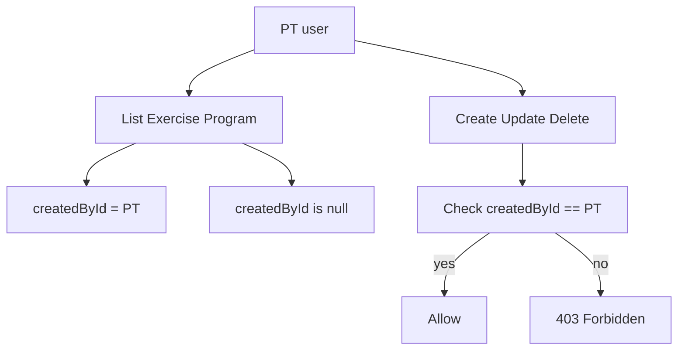

# PT ownership cho Exercise/Program

## Mục tiêu

Cho PT xem danh sách `own + admin`, nhưng chỉ được sửa/xóa dữ liệu do chính PT đó tạo.

## Thay đổi dữ liệu

- Cập nhật schema tại [`/Users/ad/Documents/Petproject/bestGym/backend/prisma/schema.prisma`](/Users/ad/Documents/Petproject/bestGym/backend/prisma/schema.prisma):
  - `Exercise`: thêm `createdById String?`, relation đến `Account`.
  - `Program`: thêm `createdById String?`, relation đến `Account`.
  - `Account`: thêm 2 relation ngược (`createdExercises`, `createdPrograms`).
- Migration:
  - Backfill dữ liệu cũ với `createdById = null` (coi là dữ liệu hệ thống/Admin-shared).
  - Tạo index `@@index([createdById])` cho cả `Exercise` và `Program`.

## Service/Controller cần sửa

- Exercise:
  - [`/Users/ad/Documents/Petproject/bestGym/backend/src/excercise/excercise.controller.ts`](/Users/ad/Documents/Petproject/bestGym/backend/src/excercise/excercise.controller.ts): truyền `req.user.userId` vào create/update/delete.
  - [`/Users/ad/Documents/Petproject/bestGym/backend/src/excercise/excercise.service.ts`](/Users/ad/Documents/Petproject/bestGym/backend/src/excercise/excercise.service.ts):
    - `create`: set `createdById` theo user hiện tại (PT/Admin).
    - `findAll`: nếu role PT => where `OR(createdById = currentPtId, createdById IS NULL)`; Admin giữ behavior hiện tại.
    - `update/remove`: nếu caller là PT thì bắt buộc bản ghi có `createdById = callerId`, nếu không trả `ForbiddenException`.
- Program:
  - [`/Users/ad/Documents/Petproject/bestGym/backend/src/program/program.controller.ts`](/Users/ad/Documents/Petproject/bestGym/backend/src/program/program.controller.ts): mở quyền tạo/chỉnh cho PT và truyền `req.user.userId`.
  - [`/Users/ad/Documents/Petproject/bestGym/backend/src/program/program.service.ts`](/Users/ad/Documents/Petproject/bestGym/backend/src/program/program.service.ts):
    - `create`: set `createdById`.
    - `findAll`: PT thấy `own + admin-shared` theo rule như Exercise.
    - `createProgramDay`, `addProgramDayExercise` và các API thay đổi dữ liệu: kiểm tra ownership ở level Program trước khi mutate.

## API contract

- Không bắt FE gửi thêm field owner; owner lấy từ JWT.
- PT list API giữ endpoint cũ (`GET /exercise`, `GET /program`) nhưng trả theo scope PT.
- Nếu PT sửa/xóa item không thuộc quyền: trả 403 với message rõ ràng.

## Kiểm thử

- PT A tạo Exercise/Program -> PT A thấy và sửa/xóa được.
- PT B không sửa/xóa được dữ liệu PT A.
- PT thấy dữ liệu `createdById = null` (admin-shared) nhưng không sửa/xóa.
- Admin vẫn thấy toàn bộ và sửa/xóa bình thường.
- `createProgramDay` / `addProgramDayExercise` bị chặn đúng khi program không thuộc PT gọi API.

