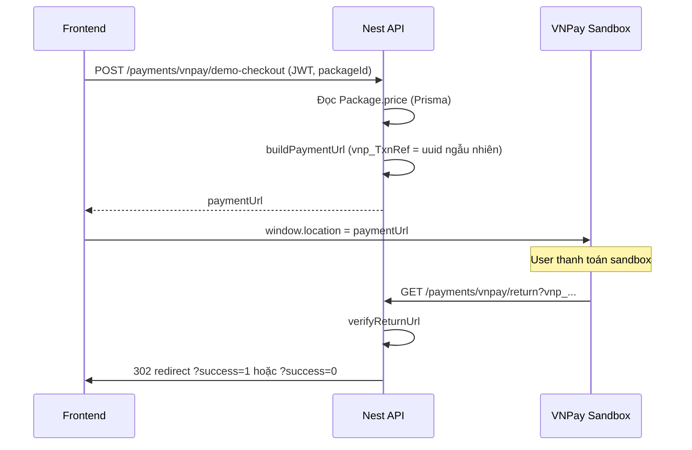

# VNPay demo (không migration)

## Mục tiêu

Chỉ cần **demo end-to-end sandbox**:

1. App/backend tạo link thanh toán VNPay.
2. User thanh toán thành công trên [sandbox VNPay](https://sandbox.vnpayment.vn).
3. VNPay **redirect** về Return URL → backend xác thực → **redirect tiếp** về trang FE (success/fail).

**Không làm trong scope demo:**

- Migration / bảng `Payment`
- IPN server-to-server (không cần ngrok cho IPN)
- Đổi `POST /user-package/purchase` (vẫn ACTIVE gói như cũ, tách biệt demo)
- Admin analytics, cron, refund, `queryDr`

Khi lên production thật → xem mục [Nâng cấp sau demo](#nâng-cấp-sau-demo) ở cuối file.

---

## Tài liệu

| Nguồn                                                        | Dùng cho demo                        |
| ------------------------------------------------------------ | ------------------------------------ |
| [nestjs-vnpay](https://github.com/lehuygiang28/nestjs-vnpay) | `VnpayModule`, `VnpayService`        |
| [vnpay.js.org](https://vnpay.js.org/)                        | `buildPaymentUrl`, `verifyReturnUrl` |
| [VNPay sandbox](https://sandbox.vnpayment.vn/apis/)          | Tài khoản test, thẻ test             |

```bash
npm install nestjs-vnpay vnpay
```

**Demo chỉ cần 2 API thư viện:**

- `buildPaymentUrl` — tạo URL redirect
- `verifyReturnUrl` — kiểm tra query khi user quay lại

`vnp_Amount`: truyền **số VND** như `package.price` (thư viện tự ×100).

---

## Luồng demo



**`vnp_TxnRef`:** UUID hoặc `demo-${Date.now()}` — **không lưu DB**, chỉ để VNPay phân biệt giao dịch trong ngày.

**Return URL** trỏ về **backend** (public được, vd. ngrok hoặc domain staging), backend verify xong redirect sang **frontend**:

```
VNPAY_RETURN_URL=https://api.example.com/payments/vnpay/return
VNPAY_FRONTEND_SUCCESS_URL=http://localhost:3000/payment/success
VNPAY_FRONTEND_FAIL_URL=http://localhost:3000/payment/fail
```

---

## Biến môi trường

```env
VNPAY_TMN_CODE=
VNPAY_SECURE_SECRET=
VNPAY_HOST=https://sandbox.vnpayment.vn
VNPAY_TEST_MODE=true

# Backend nhận redirect từ VNPay (phải public nếu test từ máy thật / điện thoại)
VNPAY_RETURN_URL=https://xxxx.ngrok-free.app/payments/vnpay/return

# FE hiển thị kết quả sau khi backend verify
VNPAY_FRONTEND_SUCCESS_URL=http://localhost:5173/payment/success
VNPAY_FRONTEND_FAIL_URL=http://localhost:5173/payment/fail
```

Đăng ký merchant tại [sandbox.vnpayment.vn](https://sandbox.vnpayment.vn) → lấy `TMN_CODE` + `Secure Secret`.

**Portal VNPay:** cấu hình Return URL trùng `VNPAY_RETURN_URL`. **IPN URL có thể bỏ trống** cho demo (hoặc điền dummy — VNPay có thể gọi nhưng backend không implement).

---

## Module & file (tối thiểu)

```
src/payment/
  payment.module.ts
  payment.service.ts
  payment.controller.ts
  dto/
    vnpay-demo-checkout.dto.ts   # packageId (bắt buộc), branchId (optional — chỉ hiển thị OrderInfo)
```

**`app.module.ts`:** import `PaymentModule`.

**Không sửa** `prisma/schema.prisma`.

---

## API endpoints (demo)

| Method | Path                            | Auth       | Mô tả                                                |
| ------ | ------------------------------- | ---------- | ---------------------------------------------------- |
| `POST` | `/payments/vnpay/demo-checkout` | USER (JWT) | Lấy giá gói → trả `{ paymentUrl, txnRef, amount }`   |
| `GET`  | `/payments/vnpay/return`        | Public     | Nhận query VNPay → `verifyReturnUrl` → `302` sang FE |

### `POST /payments/vnpay/demo-checkout`

**Body (gợi ý):**

```json
{ "packageId": "uuid-gói" }
```

**Logic:**

1. `package.findUnique` — `isActive`, lấy `price`, `name`.
2. `vnp_TxnRef = randomUUID()` (hoặc `demo-${uuid}`).
3. `buildPaymentUrl`:
   - `vnp_Amount`: `package.price`
   - `vnp_OrderInfo`: `Thanh toan goi ${name}` (không dấu)
   - `vnp_TxnRef`
   - `vnp_IpAddr`: `req.ip` hoặc `127.0.0.1`
   - `vnp_ReturnUrl`: `config VNPAY_RETURN_URL`
   - `vnp_ExpireDate`: +15 phút (optional, dùng `dateFormat` từ `vnpay`)
4. Response JSON cho FE mở tab.

**Không** gọi `purchasePackage` ở bước này.

### `GET /payments/vnpay/return`

**Logic:**

1. `const result = await vnpayService.verifyReturnUrl(req.query)`.
2. Nếu `result.isVerified && result.isSuccess` (hoặc `vnp_ResponseCode === '00'` theo docs thư viện):
   - `redirect(VNPAY_FRONTEND_SUCCESS_URL + '?txnRef=' + result.vnp_TxnRef + '&amount=' + ...)`
3. Ngược lại → `VNPAY_FRONTEND_FAIL_URL` + mã lỗi.

Có thể trả JSON thay redirect nếu demo chỉ test Postman — nhưng **redirect 302** giống production UX hơn.

---

## Quan hệ với luồng hiện tại

| Luồng                         | Hành vi demo                                                    |
| ----------------------------- | --------------------------------------------------------------- |
| `POST /user-package/purchase` | **Giữ nguyên** — vẫn tạo `UserPackage` ACTIVE không qua VNPay   |
| Demo VNPay                    | Chỉ chứng minh cổng thanh toán; **không** tạo/sửa `UserPackage` |

Nếu muốn demo “trông như mua gói” (tuỳ chọn, **không bắt buộc**):

- Sau redirect success, FE gọi `POST /user-package/purchase` với cùng `packageId`/`branchId` — tách 2 bước, dễ hiểu là mock.
- Hoặc một query `?autoPurchase=1` trên return redirect → backend gọi `purchasePackage` **chỉ khi** verify success (vẫn không cần bảng Payment; **không khuyến nghị** trừ khi cần demo 1 nút).

---

## Frontend (gợi ý tối thiểu)

```ts
// 1. Gọi checkout
const { paymentUrl } = await api.post('/payments/vnpay/demo-checkout', {
  packageId,
});
window.location.href = paymentUrl;

// 2. Trang /payment/success đọc query ?txnRef= & hiển thị "Thanh toán demo thành công"
```

---

## Cấu hình nestjs-vnpay

```ts
// payment.module.ts
VnpayModule.registerAsync({
  imports: [ConfigModule],
  useFactory: (config: ConfigService) => ({
    tmnCode: config.getOrThrow('VNPAY_TMN_CODE'),
    secureSecret: config.getOrThrow('VNPAY_SECURE_SECRET'),
    vnpayHost: config.get('VNPAY_HOST', 'https://sandbox.vnpayment.vn'),
    testMode: config.get('VNPAY_TEST_MODE') !== 'false',
    hashAlgorithm: 'SHA512',
    enableLog: true,
    loggerFn: ignoreLogger,
  }),
  inject: [ConfigService],
}),
```

```ts
// payment.service.ts — inject VnpayService
const paymentUrl = this.vnpayService.buildPaymentUrl({
  vnp_Amount: pkg.price,
  vnp_OrderInfo: `Thanh toan goi ${pkg.name}`,
  vnp_TxnRef: txnRef,
  vnp_IpAddr: ip,
  vnp_ReturnUrl: this.config.getOrThrow('VNPAY_RETURN_URL'),
});
```

---

## Checklist test sandbox

- [ ] Có `TMN_CODE` + `SECRET` sandbox
- [ ] `VNPAY_RETURN_URL` public (ngrok) nếu test từ mobile
- [ ] `POST demo-checkout` → mở `paymentUrl`
- [ ] Thanh toán thẻ test sandbox → về `/payments/vnpay/return`
- [ ] Redirect FE `/payment/success?txnRef=...`
- [ ] Thử hủy thanh toán → redirect `/payment/fail`

---

## Files tạo/sửa (demo)

| File                   | Hành động                                  |
| ---------------------- | ------------------------------------------ |
| `package.json`         | + `nestjs-vnpay`, `vnpay`                  |
| `.env.example`         | + biến VNPay (không commit secret)         |
| `src/payment/*`        | Module mới                                 |
| `src/app.module.ts`    | Import `PaymentModule`                     |
| `prisma/schema.prisma` | **Không đổi**                              |
| `user-package/*`       | **Không đổi** (trừ tuỳ chọn auto-purchase) |
| `admin-analytics/*`    | **Không đổi**                              |

---

## Nâng cấp sau demo

Khi cần production thật, bổ sung lần lượt:

1. Bảng `Payment` + migration
2. `POST /user-package/checkout` thay `purchase` trực tiếp
3. **IPN** (`verifyIpnCall`) làm nguồn sự thật — Return URL chỉ UX
4. Idempotent, đối soát amount, analytics theo `paidAt`

Tham chiếu plan đầy đủ có thể tái dùng các mục IPN/schema từ phiên bản trước khi cần.

---

## Thứ tự implement

1. `install-vnpay-module`
2. `payment-demo-module` + env
3. `demo-checkout-endpoint`
4. `demo-return-redirect`
5. `sandbox-smoke-test`

Bật **Agent mode** khi muốn code theo plan này.
