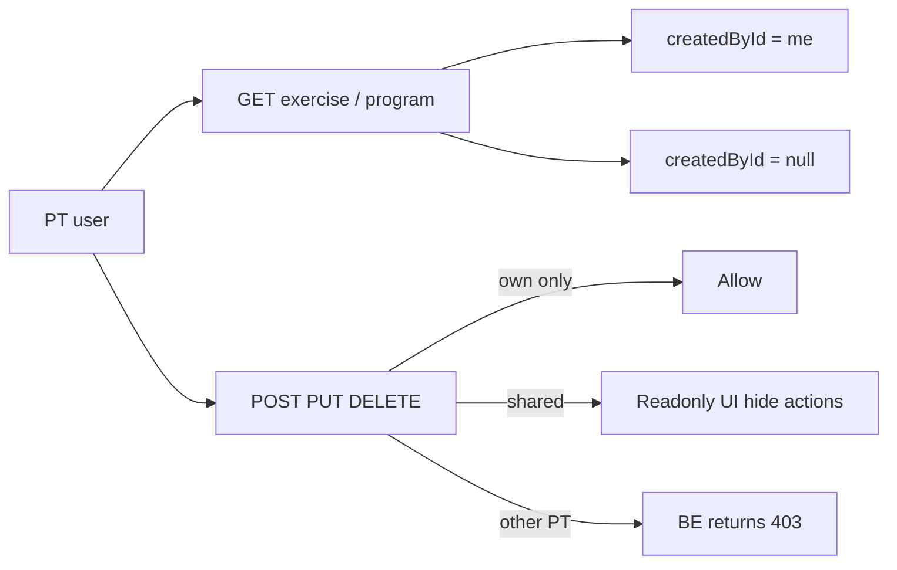

## Bối cảnh

BE plan [backend/.cursor/plans/pt_owner_exercise_program_51926aed.plan.md](backend/.cursor/plans/pt_owner_exercise_program_51926aed.plan.md) đã thêm `createdById` cho `Exercise`/`Program` và scope dữ liệu theo role:

- `GET /exercise`, `GET /program` → PT thấy `own + null (admin-shared)`.
- `POST /exercise`, `POST /program` → BE tự set `createdById` từ JWT, mở cho PT.
- `PUT /exercise/:id`, `DELETE /exercise/:id` → PT chỉ sửa/xóa được item của mình (403 nếu không phải).
- `POST /program/:id/days`, `POST /program/:id/days/:dayId/exercises` → PT phải sở hữu Program.
- BE chưa có Update/Delete cho Program.



## Quyết định đã chốt

- 2 route riêng: `/pt/exercises`, `/pt/programs` (theo cấu trúc admin).
- Exercise: full CRUD; Program: Create + addDay + addExerciseToDay; item admin-shared (`createdById = null`) hiện badge "Hệ thống" và ẩn Edit/Delete.

## Thay đổi dự kiến

### 1. Types — [app/types/types.ts](frontend/app/types/types.ts)

- Thêm vào `interface Exercise`:

```ts
createdById?: string | null;
```

- Thêm vào `interface Program`:

```ts
createdById?: string | null;
```

- Thêm `UpdateExerciseRequest` (Partial của các field create, không gồm `name` bắt buộc).

### 2. API constants — [app/services/constant.ts](frontend/app/services/constant.ts)

Bổ sung trong `EXERCISE`:

```ts
UPDATE_EXERCISE: (id: string) => `/exercise/${id}`,
DELETE_EXERCISE: (id: string) => `/exercise/${id}`,
```

### 3. API functions — [app/services/api.ts](frontend/app/services/api.ts)

Thêm `updateExercise(id, payload)` (PUT) và `deleteExercise(id)` (DELETE). Giữ nguyên các hàm `getExercises`, `getPrograms`, `createExercise`, `createProgram`, `createProgramDay`, `createProgramDayExercise` (BE đã scope theo role tự động).

### 4. Trang mới — `app/(main)/pt/exercises/page.tsx`

Copy structure từ [app/admin/exercise/page.tsx](frontend/app/admin/exercise/page.tsx), điều chỉnh:

- Query key đổi sang `pt-exercises` để tránh cache collision với admin.
- Lấy `currentUserId` từ store auth (hoặc decode JWT) để xác định ownership tại client.
- Thêm cột "Nguồn": badge `Của tôi` (createdById === currentUserId) hoặc `Hệ thống` (createdById null/khác).
- Cột "Action": chỉ hiện khi `createdById === currentUserId`:
  - Nút Edit → mở Modal "Sửa bài tập" (form giống Modal Tạo, prefill, gọi `updateExercise`).
  - Nút Delete → `Modal.confirm` rồi gọi `deleteExercise`.
- Toast 403 khi BE chặn (PT cố sửa item không phải của mình) — bắt error code 403.
- Tiêu đề trang "Bài tập của tôi" + filter mặc định `isActive=true`, có toggle ẩn/hiện inactive.

### 5. Trang mới — `app/(main)/pt/programs/page.tsx`

Copy structure từ [app/admin/program/page.tsx](frontend/app/admin/program/page.tsx), điều chỉnh:

- Query key `pt-programs`, `pt-exercises-picker`.
- Hiển thị badge "Của tôi" / "Hệ thống" trên header mỗi Collapse Program.
- Ẩn nút "Thêm ngày tập" và "Thêm bài tập" trên Program admin-shared (hiển thị tag "Chỉ xem").
- Tiêu đề "Chương trình của tôi", giữ Modal Create Program / Create Day / Add Exercise như admin.
- Khi PT mở Modal "Thêm bài tập vào ngày", `Select` gọi `getExercises` (BE đã scope `own + null`) → PT chỉ thấy bài tập hợp lệ.

### 6. Header navigation — [app/components/Header.tsx](frontend/app/components/Header.tsx)

Trong nhánh `user?.role === 'PT'` (line 220-231) thêm 2 menu items sau "Lịch dạy":

```tsx
{ key: 'pt-exercises', label: <Link href="/pt/exercises">Bài tập của tôi</Link> },
{ key: 'pt-programs',  label: <Link href="/pt/programs">Chương trình của tôi</Link> },
```

### 7. Helper xác định ownership

Tạo hook nhỏ `useCurrentUserId()` trong [app/hooks/](frontend/app/hooks/) (nếu chưa có) đọc từ store auth (zustand) — hoặc dùng trực tiếp `useAuthStore` sẵn có. Dùng để so sánh `record.createdById === currentUserId`.

Quy ước:

- `Của tôi` (badge xanh): `createdById && createdById === currentUserId`.
- `Hệ thống` (badge xám): `createdById == null`.
- Trường hợp khác (PT khác tạo): với role PT thì BE đã filter ra rồi, không xảy ra.

## Lưu ý / Out-of-scope

- Không sửa admin pages trong scope này; nếu muốn admin cũng có Edit/Delete Exercise, sẽ làm follow-up (đã có sẵn API).
- Khi BE bổ sung `PUT/DELETE /program/:id`, FE sẽ thêm sau (theo plan riêng).
- Pre-existing TS errors trong `app/(main)/profile/page.tsx` (mismatched muscle group enum) không thuộc phạm vi này.
