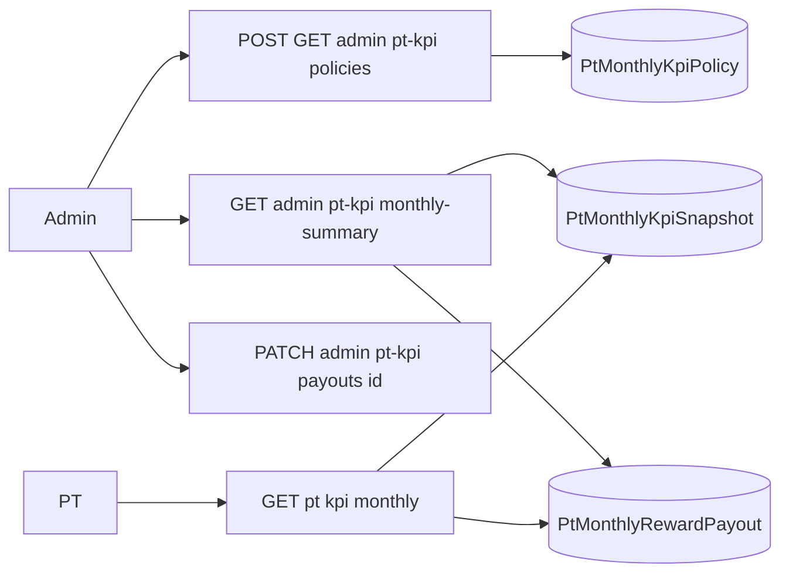

## Bối cảnh

BE đã có 2 controller riêng cho ADMIN và PT, dữ liệu được snapshot/finalize cuối tháng.



Quyết định đã chốt:

- Sửa payout: Modal form `amountFinal` (number, >=0), `status` (Select: DRAFT/APPROVED/PAID/VOID), `note` (textarea, optional).
- PT chỉ cần Month picker (không timeline history).

## Thay đổi dự kiến

### 1. Types — [app/types/types.ts](frontend/app/types/types.ts)

```ts
export type PtMonthlyRewardPayoutStatus =
  | 'DRAFT'
  | 'APPROVED'
  | 'PAID'
  | 'VOID';
export type PtMonthlyRewardPayoutSource = 'AUTO' | 'MANUAL_OVERRIDE';

export interface PtMonthlyKpiPolicy {
  id: string;
  monthKey: string;
  targetTrainees: number;
  targetSessions: number;
  rewardAmount: number;
  isActive: boolean;
  createdByAdminId: string;
  createdByAdmin?: { id: string; email: string };
  createdAt: string;
  updatedAt: string;
}

export interface PtMonthlyRewardPayout {
  id: string;
  monthKey: string;
  ptAccountId: string;
  snapshotId: string | null;
  amountAuto: number;
  amountFinal: number;
  status: PtMonthlyRewardPayoutStatus;
  source: PtMonthlyRewardPayoutSource;
  approvedByAdminId: string | null;
  approvedByAdmin?: { id: string; email: string } | null;
  note: string | null;
  createdAt: string;
  updatedAt: string;
}

export interface PtKpiMonthlySummaryRow {
  ptAccountId: string;
  email: string;
  name: string | null;
  avatar: string | null;
  distinctTrainees: number;
  acceptedSessions: number;
  achieved: boolean;
  rewardAmountAuto: number;
  payout: PtMonthlyRewardPayout | null;
}

export interface PtKpiMonthlySummaryResponse {
  message: string;
  data: {
    monthKey: string;
    policy: PtMonthlyKpiPolicy | null;
    rows: PtKpiMonthlySummaryRow[];
  };
}

export interface PtKpiPolicyResponse {
  message: string;
  data: PtMonthlyKpiPolicy | null;
}

export interface UpsertPtKpiPolicyRequest {
  monthKey: string;
  targetTrainees: number;
  targetSessions: number;
  rewardAmount: number;
  isActive?: boolean;
}

export interface UpsertPtKpiPolicyResponse {
  message: string;
  data: PtMonthlyKpiPolicy;
}

export interface UpdatePtKpiPayoutRequest {
  amountFinal?: number;
  status?: PtMonthlyRewardPayoutStatus;
  note?: string;
}

export interface UpdatePtKpiPayoutResponse {
  message: string;
  data: PtMonthlyRewardPayout;
}

export interface PtMonthlyKpiResponse {
  message: string;
  data: {
    monthKey: string;
    distinctTrainees: number;
    acceptedSessions: number;
    kpiTarget: {
      targetTrainees: number;
      targetSessions: number;
      rewardAmount: number;
    };
    progress: { traineePercent: number; sessionPercent: number };
    achieved: boolean;
    estimatedReward: number;
    payoutStatus: PtMonthlyRewardPayoutStatus | null;
  };
}
```

### 2. Routes — [app/services/constant.ts](frontend/app/services/constant.ts)

Thêm group `PT_KPI` (cả admin và PT) vào `API_PROPS` và `API`:

```ts
PT_KPI: {
  ADMIN_GET_POLICY: '/admin/pt-kpi/policies',
  ADMIN_UPSERT_POLICY: '/admin/pt-kpi/policies',
  ADMIN_GET_MONTHLY_SUMMARY: '/admin/pt-kpi/monthly-summary',
  ADMIN_UPDATE_PAYOUT: (payoutId: string) => `/admin/pt-kpi/payouts/${payoutId}`,
  PT_GET_MONTHLY: '/pt/kpi/monthly',
},
```

### 3. API client — [app/services/api.ts](frontend/app/services/api.ts)

Thêm 5 hàm:

- `getPtKpiPolicy(monthKey?)` → `PtKpiPolicyResponse`.
- `upsertPtKpiPolicy(payload)` → `UpsertPtKpiPolicyResponse`.
- `getPtKpiMonthlySummary(monthKey?)` → `PtKpiMonthlySummaryResponse`.
- `updatePtKpiPayout(payoutId, payload)` → `UpdatePtKpiPayoutResponse`.
- `getMyPtKpiMonthly(monthKey?)` → `PtMonthlyKpiResponse`.

### 4. Trang Admin — `app/admin/pt-kpi/page.tsx` (mới)

- Header: `Typography.Title` "KPI hằng tháng PT" + `DatePicker picker="month"` (mặc định tháng hiện tại; chuyển ra `yyyy-MM` cho query).
- Card "Chính sách KPI tháng X":
  - Hiển thị policy hiện tại (target trainees, target sessions, reward amount, isActive, người tạo, updatedAt).
  - Nút "Cập nhật / Tạo chính sách" → mở Modal form (`InputNumber` cho 3 số, `Switch` cho isActive). Submit gọi `upsertPtKpiPolicy` với `monthKey` đang chọn.
  - Nếu `policy === null`, banner "Chưa có chính sách cho tháng này" + nút Tạo.
- Bảng "Bảng tổng hợp PT":
  - Cột: Avatar+Name(email), `distinctTrainees / targetTrainees`, `acceptedSessions / targetSessions`, `Đạt KPI` (Tag green/red), `Reward auto` (formatNumber + " VND"), Payout: `amountFinal` + `Tag` theo status, Action.
  - Action: nút "Sửa payout" mở Modal:
    - Form: `amountFinal` (`InputNumber`, default = `payout?.amountFinal ?? rewardAmountAuto`), `status` (`Select` 4 option), `note` (`Input.TextArea`).
    - Submit gọi `updatePtKpiPayout(payoutId, body)`. Disable nút nếu `row.payout == null` (chưa finalize) — hiển thị tag "Chưa finalize".
  - Loading skeleton + empty state.
- Sau mỗi mutation: `queryClient.invalidateQueries(['admin-pt-kpi-summary', monthKey])` và `(['admin-pt-kpi-policy', monthKey])`.

### 5. Trang PT — `app/(main)/pt/kpi/page.tsx` (mới)

- Layout dùng wrapper giống `app/(main)/pt/trainee/page.tsx`: `min-h-screen bg-background pb-16 pt-10` + `mx-auto w-full max-w-6xl px-4`.
- Header: `Typography.Title` "KPI tháng của tôi" + `DatePicker picker="month"`.
- Grid 2 cột (responsive) các card:
  - Card "Tiến độ":
    - 2 progress bar dùng `<Progress percent={progress.traineePercent} />` + label `distinctTrainees / kpiTarget.targetTrainees học viên`.
    - Tương tự cho session.
  - Card "Trạng thái":
    - Tag lớn `Đã đạt KPI` (green) / `Chưa đạt` (default) theo `achieved`.
    - Mục `Phần thưởng dự kiến`: `formatNumber(estimatedReward)` VND.
    - Mục `Trạng thái payout`: Tag theo enum (DRAFT=Mới, APPROVED=Đã duyệt, PAID=Đã thanh toán, VOID=Hủy) hoặc `Chưa finalize` nếu null.
  - Card "Mục tiêu tháng":
    - Liệt kê `targetTrainees`, `targetSessions`, `rewardAmount`. Nếu policy chưa có (target = 0), hiển thị note "Chưa có chính sách KPI cho tháng này".

### 6. Navigation

- [app/admin/layout.tsx](frontend/app/admin/layout.tsx): thêm `menuItem` "PT KPI" với icon `TrophyOutlined`, link `/admin/pt-kpi`. Cập nhật [app/config/appRoute.ts](frontend/app/config/appRoute.ts) thêm `admin.ptKpi: '/admin/pt-kpi'`.
- [app/components/Header.tsx](frontend/app/components/Header.tsx) (nhánh `role === 'PT'`): thêm item `pt-kpi` → `<Link href="/pt/kpi">KPI của tôi</Link>` đặt ngay sau "Lịch dạy".

### 7. Helpers

- Map status → label/color VN (đặt trong `app/lib/ptKpiLabels.ts`):

```ts
export const PT_PAYOUT_STATUS_LABELS = {
  DRAFT: 'Nháp',
  APPROVED: 'Đã duyệt',
  PAID: 'Đã thanh toán',
  VOID: 'Hủy',
} as const;
export const PT_PAYOUT_STATUS_COLORS = {
  DRAFT: 'default',
  APPROVED: 'blue',
  PAID: 'green',
  VOID: 'red',
} as const;
```

- Helper `monthKeyFromDayjs(d)` → `d.format('YYYY-MM')` để truyền BE.

## Out-of-scope

- Không expose endpoint `finalizeMonth` trên FE (BE hiện chỉ dùng nội bộ qua cron/script).
- Chưa làm timeline history nhiều tháng cho PT — sẽ làm theo plan riêng nếu cần.
- Chưa làm export CSV bảng admin — có thể thêm sau.
- Pre-existing TS errors trong `app/(main)/profile/page.tsx` không thuộc phạm vi.
