## Bối cảnh BE đã thay đổi

- `Package.ptSessionsIncluded` (bắt buộc khi `hasPt`).
- `UserPackage.ptSessionsGranted`; response thêm `ptSessionsRemaining`, `ptAssistSessionsUsed`.
- `POST /user-package/purchase` không còn nhận `ptAccountId`, set `ACTIVE` ngay.
- Endpoint book buổi PT: `POST /user-package/pt-assist-request` body `{ userPackageId, slotId, sessionDate, note? }` (xem [backend/src/user-package/user-package.service.ts](backend/src/user-package/user-package.service.ts) `createRequestPT`).
- PT-side `getRequestedPackages` / `getAcceptedPackages` đã chuyển sang dựa trên `PtAssistRequest`; `acceptedRequest`/`rejectedRequest` đã `@deprecated`.

## Quyết định đã chốt

- Đặt buổi PT: trang riêng `/my-packages/[id]/book-pt`.
- Bỏ tab "Chờ duyệt" trong [app/(main)/pt/trainee/page.tsx](<app/(main)/pt/trainee/page.tsx>); duyệt theo từng buổi gom hết về tab "Yêu cầu hỗ trợ".

## Kiến trúc luồng mới (FE)

```mermaid
flowchart LR
  Pkgs[/packages page/] --> Buy[/purchasePackage Pkg + Branch + Confirm/]
  Buy --> Active["UserPackage ACTIVE + quota"]
  Active --> MyPkgs[/my-packages with PT quota chip/]
  MyPkgs -->|"Đặt buổi PT"| BookPT[/my-packages id book-pt/]
  BookPT -->|"createPtAssistRequest"| Pending["PtAssistRequest PENDING"]
  Pending --> PtTabAssist[/pt trainee Yêu cầu hỗ trợ/]
  PtTabAssist -->|accept/reject| Calendar[/pt schedule/]
```



## Thay đổi cụ thể

### 1. Types & API constants

- [app/types/types.ts](app/types/types.ts):
  - `Package`: thêm `ptSessionsIncluded?: number | null`.
  - `MyPurchasePackage`: thêm `ptSessionsGranted?: number | null`, `ptSessionsRemaining?: number | null`, `ptAssistSessionsUsed?: number`; cho `ptAccount` thành optional/nullable cho dữ liệu legacy.
  - `CreatePackageRequest`: thêm `ptSessionsIncluded?: number`.
  - Bỏ `ptAccountId` khỏi `PurchasePackageRequest` (giữ optional nếu cần backward compat, không gửi đi).
  - Thêm interface mới:

```ts
export interface CreatePtAssistRequestRequest {
  userPackageId: string;
  slotId: string;
  sessionDate: string;
  note?: string;
}
export interface CreatePtAssistRequestResponse {
  message: string;
  data: { id: string; status: "PENDING" };
}
```

- [app/services/constant.ts](app/services/constant.ts): thêm `USER.CREATE_PT_ASSIST_REQUEST: '/user-package/pt-assist-request'`.
- [app/services/api.ts](app/services/api.ts): thêm `createPtAssistRequest(payload)`.

### 2. Mua gói — bỏ bước chọn PT

- [app/(main)/purchasePackage/page.tsx](<app/(main)/purchasePackage/page.tsx>):
  - Bỏ state `selectedPtId`, `ptSearch`, `ptShiftType`, `ptFromDate`, `ptToDate` và query `getAvailablePTs`.
  - `steps` còn `['Gói tập', 'Cơ sở', 'Xác nhận']`; bỏ block `requirePt && currentStep === 2`.
  - `payload` không còn `ptAccountId`.
- [app/components/purchase/ConfirmPurchaseStep.tsx](app/components/purchase/ConfirmPurchaseStep.tsx): thay item "Huấn luyện viên cá nhân" bằng dòng "Số buổi PT" hiển thị `selectedPackage.ptSessionsIncluded` khi `hasPt`.
- [app/components/purchase/SelectPtStep.tsx](app/components/purchase/SelectPtStep.tsx): tái sử dụng nguyên cho trang Book PT (không xoá).

### 3. Admin tạo gói

- [app/components/form/CreatePackageForm.tsx](app/components/form/CreatePackageForm.tsx):
  - Thêm `Form.Item` `ptSessionsIncluded` (`InputNumber min={1}`) hiển thị có điều kiện qua `Form.useWatch('hasPt')`.
  - `onFinish` chỉ gửi `ptSessionsIncluded` khi `hasPt === true`.
- [app/admin/package/page.tsx](app/admin/package/page.tsx): thêm cột "Số buổi PT" (`record.hasPt ? record.ptSessionsIncluded : '—'`).

### 4. Package card

- [app/components/card/packageCard.tsx](app/components/card/packageCard.tsx) `getFeatures`: khi `pkg.hasPt`, đổi label "Huấn luyện viên cá nhân" thành `${pkg.ptSessionsIncluded ?? 0} buổi PT cá nhân`.

### 5. My packages — hiển thị quota + nút đặt lịch

- [app/(main)/my-packages/page.tsx](<app/(main)/my-packages/page.tsx>):
  - Bỏ block "PT: {name}" cho gói mới (dữ liệu mới `ptAccount` sẽ null); chỉ render khi `pt && item.status === 'ACTIVE'` và đánh dấu là legacy.
  - Với `pkg.hasPt`: thêm chip "Buổi PT còn lại: `{ptSessionsRemaining ?? '—'} / {ptSessionsGranted ?? pkg.ptSessionsIncluded ?? 0}`".
  - Thêm nút primary "Đặt buổi PT" → `router.push('/my-packages/' + item.id + '/book-pt')`; disable khi `status !== 'ACTIVE'` hoặc `ptSessionsRemaining === 0`.

### 6. Trang mới — Đặt buổi PT

- File mới [app/(main)/my-packages/[id]/book-pt/page.tsx](<app/(main)/my-packages/[id]/book-pt/page.tsx>):
  - Lấy `userPackageId` từ params; query `getMyPurchasePackages` rồi pick item theo id để có `branchId`, `ptSessionsRemaining`, `package.hasPt`, `startAt`/`endAt`. (Có thể bổ sung `getUserDetailPackage` về sau, hiện chưa có function FE.)
  - Reuse [app/components/purchase/SelectPtStep.tsx](app/components/purchase/SelectPtStep.tsx) cho list PT (filter ngày/ca/search) qua `getAvailablePTs({ branchId, ... })`.
  - Sau khi chọn PT, hiển thị accordion các `ptShiftSchedules` (slot) của PT đó:
    - Mỗi slot show `shiftTemplate.startTime-endTime` + range `fromDate→toDate`.
    - Cho chọn `sessionDate` qua `DatePicker` (giới hạn `disabledDate` ngoài `[fromDate, toDate]` và ngoài `[userPackage.startAt, userPackage.endAt]`).
  - Form: `slotId` (radio trên slot đã chọn), `sessionDate`, `note?`.
  - Submit `createPtAssistRequest`; toast + redirect về `/my-packages` khi thành công.
  - Chặn submit khi `ptSessionsRemaining <= 0` và hiển thị banner "Hết quota".

### 7. PT trainee page — bỏ tab legacy

- [app/(main)/pt/trainee/page.tsx](<app/(main)/pt/trainee/page.tsx>):
  - Bỏ tab `pending` và toàn bộ logic `getTraineeRequests`, `approveTraineeRequest`, `rejectTraineeRequest`.
  - Giữ 2 tab: `active` (Học viên của tôi) và `assist` (Yêu cầu hỗ trợ — đã đúng theo flow mới).
  - Trong tab `active`, dedupe theo `userPackageId` (vì 1 user có thể xuất hiện nhiều lần do nhiều `PtAssistRequest`).

### 8. PT schedule

- [app/(main)/pt/schedule/page.tsx](<app/(main)/pt/schedule/page.tsx>): không đổi logic dữ liệu; (tuỳ chọn) trong modal chi tiết hiển thị `userPackage.ptSessionsRemaining` nếu BE include — không bắt buộc trong scope này.

### 9. Dọn dẹp

- Có thể giữ `getPtAccounts`, `approveTraineeRequest`, `rejectTraineeRequest` trong [app/services/api.ts](app/services/api.ts) nhưng không gọi ở đâu nữa — đánh dấu comment `// legacy` để dễ remove sau.

## Lưu ý kiểm thử nhanh

- Mua gói có PT: payload không gửi `ptAccountId`, gói lên `ACTIVE` ngay, my-packages hiển thị chip quota đầy đủ.
- Đặt buổi PT trong quota: tạo PENDING, quota giảm; vượt quota thì BE trả 400 và FE show toast lỗi.
- PT vào `/pt/trainee` chỉ thấy 2 tab; accept/reject ở tab assist hoạt động bình thường.
