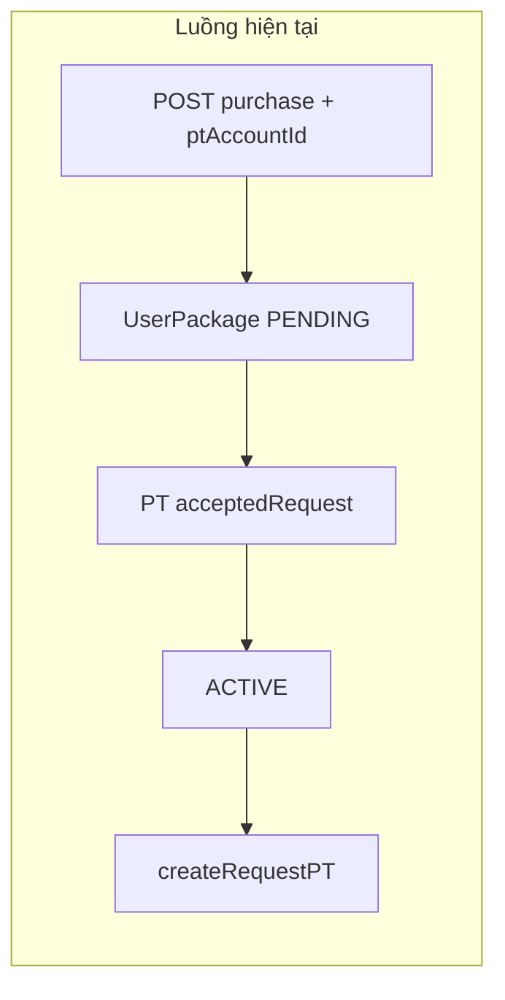
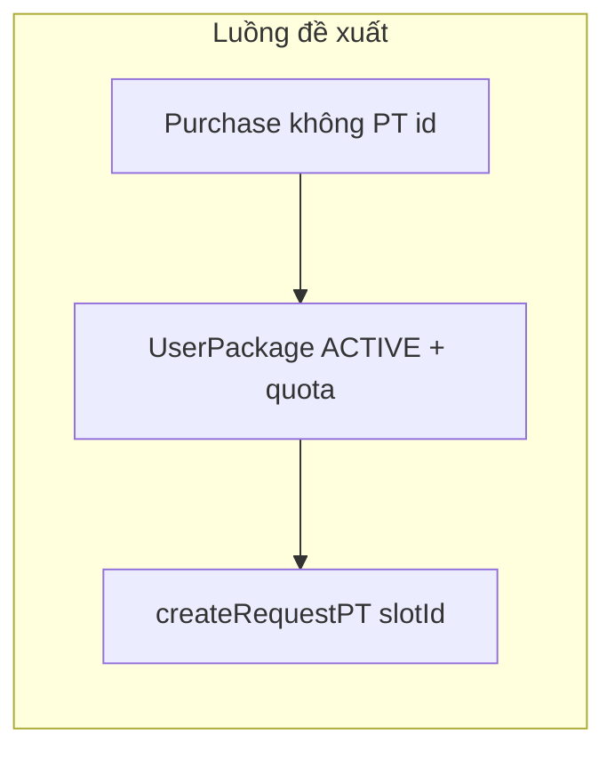

# Đổi logic PT: quota trên gói + chọn PT lúc book

## Hiện trạng trong code của bạn

- **[`prisma/schema.prisma`](/Users/ad/Documents/Petproject/bestGym/backend/prisma/schema.prisma)**: `Package` chỉ có `hasPt` (không có số buổi). `UserPackage` có `ptAccountId` (PT cố định) và flow gói PT tạo bản ghi **`PENDING`** cho đến khi PT chấp nhận “gán gói”.
- **[`src/user-package/user-package.service.ts`](/Users/ad/Documents/Petproject/bestGym/backend/src/user-package/user-package.service.ts)** — `purchasePackage`: nếu `hasPt` thì **bắt buộc `ptAccountId`**, validate PT ACTIVE, create `UserPackage` với `ptAccountId` + `PENDING`.
- **`createRequestPT` (cùng file)**: yêu cầu **`userPackage.ptAccountId`** và so khớp **`selectedSlot.ptAccountId`** với PT đã gán — đúng với mô hình “một PT suốt đời gói”.
- **[`src/user-package/dto/purchase-package.dto.ts`](/Users/ad/Documents/Petproject/bestGym/backend/src/user-package/dto/purchase-package.dto.ts)** / **[`dto/create-package.dto.ts`](/Users/ad/Documents/Petproject/bestGym/backend/src/package/dto/create-package.dto.ts)** chưa có field số buổi PT.
- **[`src/personal-trainer/personal-trainer.service.ts`](/Users/ad/Documents/Petproject/bestGym/backend/src/personal-trainer/personal-trainer.service.ts)**: **`getRequestedPackages` / `acceptedRequest` / `rejectedRequest`** phụ thuộc `UserPackage.ptAccountId` + `PENDING` — đây là luồng “PT duyệt gói trước khi ACTIVE”, không còn phù hợp sau khi bỏ chọn PT lúc mua.

## Hướng mới (định danh chức năng)

1. **Định nghĩa gói**: `hasPt = true` thì có thêm **`ptSessionsIncluded`** (integer &gt; 0). `hasPt = false` thì field này `null`/0 không dùng.
2. **Mua gói**: không gửi / không lưu PT; gói PT **ACTIVE ngay** (set `startAt`/`endAt`/`activatedAt` giống nhánh không PT trong `purchasePackage`), copy quota vào **`UserPackage`** (xem ô dữ liệu bên dưới).
3. **Book buổi PT**: user chọn **slot** (`slotId` đã chứa `ptAccountId` trong `PtShiftSchedule`) → PT của buổi đó được suy ra từ slot; không cần thêm field `ptAccountId` vào DTO trừ khi bạn giới hạn chỉ được chọn một slot không “trust” được. **Luôn kiểm tra**: số request **PENDING + ACCEPTED** (hoặc counter) không vượt quota.
4. **Luồng PT**: giữ **`acceptPtAssistRequest` / `rejectPtAssistRequest`** cho từng **buổi** (`PtAssistRequest`). Luồng duyệt **cả gói** (`acceptedRequest(userPackageId)`) nên deprecate hoặc chỉ dùng cho dữ liệu cũ.

## Thay đổi cụ thể trong repo

### 1. Prisma migration

| Model         | Đề xuất                                                                                                                                                                                                                                                                                                                            |
| ------------- | ---------------------------------------------------------------------------------------------------------------------------------------------------------------------------------------------------------------------------------------------------------------------------------------------------------------------------------- |
| `Package`     | Thêm ví dụ `ptSessionsIncluded Int?` (`null` khi không PT). Validation: trong service/DTO/class-validator có điều kiện `hasPt ⇒ required & gt; 0`.                                                                                                                                                                                 |
| `UserPackage` | Thêm **`ptSessionsRemaining Int?`** (nullable; set = `package.ptSessionsIncluded` lúc mua khi `hasPt`), hoặc **`ptSessionsTotal` + used** — chọn một; “remaining” thường đơn giản cho FE. **`ptAccountId`**: có thể **giữ nullable** chỉ làm compatibility / hiển thị legacy hoặc bỏ dần; với flow mới **không set khi purchase**. |

**Quản lý quota khi có PENDING/REJECT/CANCEL**: chọn và implement nhất quán:

- **Cách A (đếm)** — không cần remaining field chính xác realtime: đếm `PtAssistRequest` theo `userPackageId` với status `IN (PENDING, ACCEPTED)` &lt;= `package.ptSessionsIncluded` (reject/cancel không tính → buổi được trả lại).
- **Cách B (atomic counter)** — khi create request tăng “reserved”, khi PT reject PT cancel decrement (phức tạp hơn nhưng rõ trong race condition).

Đề xuất bắt đầu bằng **Cách A** (đồng bộ với chỗ đã đếm `usedSeats` cho slot).

### 2. Package API

- **[`src/package/package.service.ts`](/Users/ad/Documents/Petproject/bestGym/backend/src/package/package.service.ts)** `create` / `update`: map field mới vào Prisma `data`.
- **[`CreatePackageDto`](/Users/ad/Documents/Petproject/bestGym/backend/src/package/dto/create-package.dto.ts)** (+ [`UpdatePackageDto`](/Users/ad/Documents/Petproject/bestGym/backend/src/package/dto/update-package.dto.ts) kế thừa PartialType): thêm `@IsOptional` `@IsNumber` `ptSessionsIncluded` kèm custom validator **`ValidateIf`(hasPt)** hoặc validate trong service: `hasPt && (!v \|\| v &lt;= 0) ⇒ BadRequest`.

### 3. User purchase

- **`PurchasePackageDto`**: **xóa `ptAccountId`**.
- **`purchasePackage`**: gộp nhánh có/không PT: luôn tính `startAt/endAt`, `ACTIVE`, set `ptSessionsRemaining` hoặc không set nếu không PT.

### 4. PT assist request

- **`createRequestPT`**:
  - Bỏ check `userPackage.ptAccountId` và bỏ **`selectedSlot.ptAccountId !== userPackage.ptAccountId`**.
  - Thêm kiểm tra quota (đếm hoặc counter) trước khi `create`.
  - Giữ check `package.hasPt`, ACTIVE, trong khoảng `startAt`/`endAt`, branch khớp, slot trong range ngày, maxStudents như hiện tại.

### 5. Responses / listing

- **`getUserPackages` / `getUserDetailPackage`** (cùng service): trong `package` hoặc top-level response thêm ví dụ `ptSessionsIncluded`, **`ptSessionsRemaining`** hoặc số đã dùng (derived). Quan hệ **`ptAccount`**: có thể **nullable** và không populate cho gói mới; FE không nên hiển thị “PT gói” nữa mà chỉ PT từng buổi.

### 6. PT-side “đã nhận gói của user”

- **`getAcceptedPackages` / `getRequestedPackages`** dựa trên `UserPackage.ptAccountId` sẽ **sai hoặc rỗng** với model mới. Cần thay bằng query theo **`PtAssistRequest`** (distinct `userPackage`/`account` có request PENDING hoặc đã ACCEPTED với PT này) nếu bạn vẫn cần màn đó — hoặc ẩn endpoint cho đến khi định lại UX.

### 7. Seeds & dữ liệu cũ

- **`prisma/seed.ts`** (hoặc seed packages): set `ptSessionsIncluded` cho mọi gói `hasPt: true`; backfill **`UserPackage`**: các bản ACTIVE có `hasPt` + `ptAccountId` có thể set remaining = giá trị mặc định migration (ví dụ copy từ package sau migrate) và quyết định có **auto ACTIVE** các `PENDING` cũ không.

### 8. Frontend / mobile (ngoài backend folder)

Nếu app gọi `purchase` với body `ptAccountId` và PT list từ `GET user-package/available-pts`: bỏ bước chọn PT lúc mua; **`available-pts` + slot picker** chỉ dùng ở màn **đặt lịch PT** và hiển thị **số buổi còn lại**.

---

## Một điểm cần bạn quyết (ảnh hưởng business)

**Request `PENDING` có “ăn” một buổi trong quota không?** Khuyến nghị: **có** (đếm `PENDING + ACCEPTED`) để user không spam nhiều request; khi PT **reject** hoặc user **cancel** thì không tính — buổi quay về quota.
